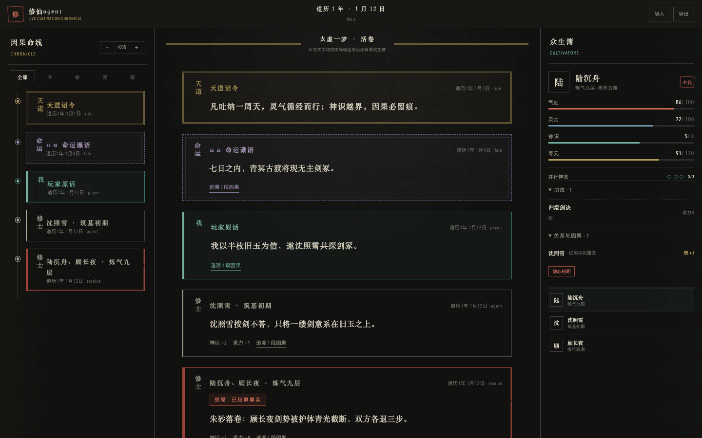
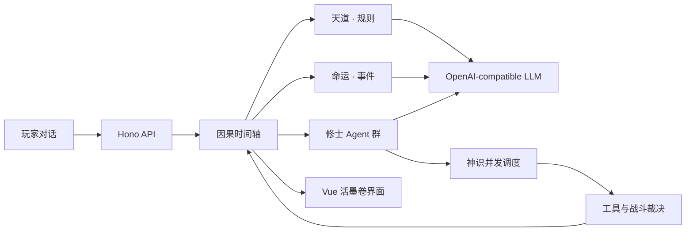

# 修仙agent

> 大模型实时驱动的可玩修仙小说。

天道生成规则，命运编织事件，玩家用自然语言控制主角，六名修士 Agent 在神识预算内观察、谋划、调用工具和战斗。每次行动都会写入可追溯的因果时间轴。



## 核心玩法

- **天道**：生成可执行的灵气、境界、寿元、因果与天劫规则。
- **命运**：只在因果链需要时生成机缘、危机与期限。
- **玩家**：直接对话、修炼、结盟、欺骗或出手。
- **修士**：拥有私有目标、有限记忆和独立工具调用。
- **神识**：同时限制认知范围、工具成本和 Agent 并行。
- **时间轴**：跳到下一个有效事件，不逐日空转。
- **对战**：修士并行提交意图，引擎统一结算，调用先后不影响胜负。

大模型 API 是强制依赖。项目不包含离线剧情或模板事件。

## 界面语言

| 来源 | 视觉标记 |
|---|---|
| 天道 | 暗金双线诏令 |
| 命运 | 幽紫虚线谶语 |
| 玩家 | 青玉对话框 |
| 修士 | 墨色人物卷 |
| 战斗 | 朱砂断裂框 |

## 架构



第一方代码统一使用 TypeScript：Vue 3/Vite Web、Hono/Node 服务、Zod 协议、SQLite 事件存档。模型层使用 Vercel AI SDK；可选 LiteLLM 子模块统一多家供应商。

## 快速启动

要求：Node.js 22.13+、pnpm 11+、支持结构化输出、工具调用和流式文本的 OpenAI-compatible 模型。

```bash
pnpm install
pnpm dev
```

打开 `http://localhost:5173`，填写 Base URL、API Key、模型名称和并发上限。三项能力校验通过后才能开局。API Key 只存在于当前浏览器内存与服务端会话内存，不写入存档或浏览器存储。

模型会话默认 12 小时有效；服务重启或会话过期后，存档仍在，重新填写模型配置即可继续。

## 使用 LiteLLM

```bash
git submodule update --init --recursive
docker compose --profile litellm up
```

LiteLLM 从锁定在 `v1.92.0` 的源码子模块构建。整套 Compose 运行时，在设置页填写 `http://litellm:4000/v1`、`LITELLM_MASTER_KEY` 和模型名 `xiuxian-model`；本地 `pnpm dev` 连接 LiteLLM 容器时使用 `http://localhost:4000/v1`。完整配置见 `litellm.config.example.yaml`。

根目录 `.env.example` 只用于 Compose 和可选服务端部署参数；模型端点与 API Key 由设置页在运行时提交。

## 开发

```bash
pnpm typecheck
pnpm test
pnpm build
```

详细设计见 [设计规格](docs/superpowers/specs/2026-07-23-xiuxian-agent-design.md)，任务拆解见 [实施计划](docs/superpowers/plans/2026-07-23-xiuxian-agent-implementation.md)。

## 安全

- 不要把 API Key 写入 `.env.example`、存档、日志或 Git。
- 远程模型端点与公网部署必须使用 HTTPS；HTTP 只用于本机或可信内网。
- 公网部署需在服务前增加鉴权，并限制服务端访问范围。
- LiteLLM master key 只保留在服务端。

## License

[MIT](LICENSE)
